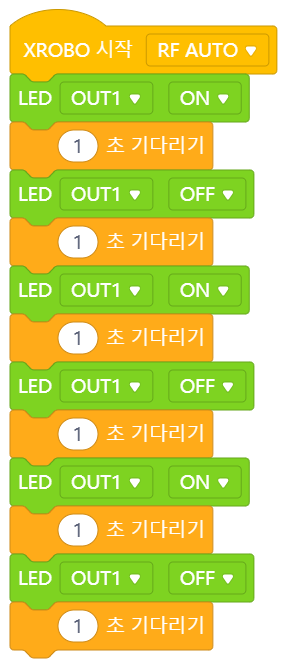
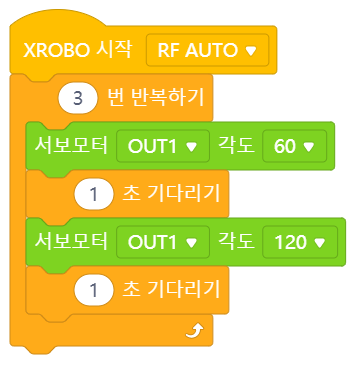
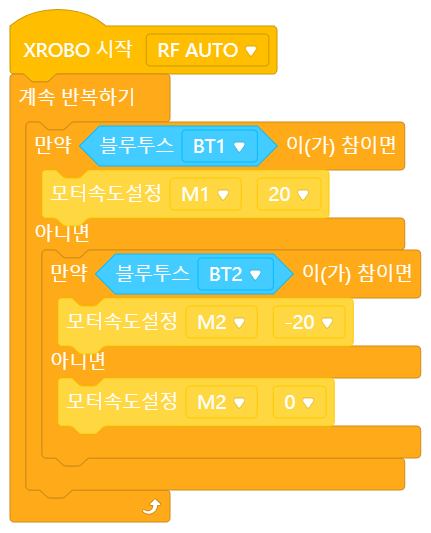
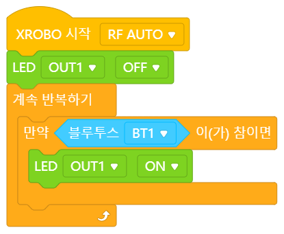
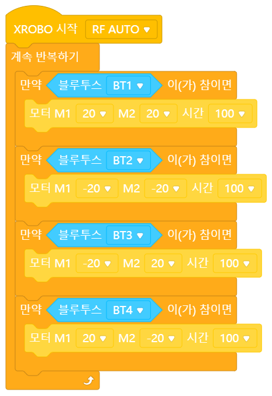
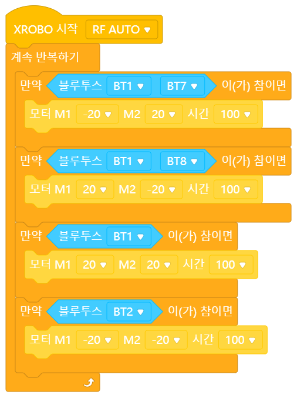

# 제어 블록

## 목차
[01 시간만큼 기다리기](#01-시간만큼-기다리기)  
[02 횟수만큼 반복하기](#02-횟수만큼-반복하기)  
[03 계속 반복하기](#03-계속-반복하기)  
[04 만약](#04-만약)  
[05 만약 아니면](#05-만약-아니면)  
[06 참일 때까지 기다리기](#06-조건-참일-때까지-기다리기)  
[07 참일 때까지 반복하기](#07-조건-참일-때까지-반복하기)  

 
 

## 01 시간만큼 기다리기  
  

### 간단 설명  
입력한 시간만큼 기다렸다가 다음 코드로 넘어가는 `제어 블록`입니다.  

### 입력상자 살펴보기 
(1) 첫번째 입력상자
- 이 입력상자에 **입력한 숫자만큼 기다린 후에 다음 코드를 실행**하게 됩니다.  
- **숫자만** 넣을 수 있습니다.  
  - 숫자를 직접 입력하거나    
  - 숫자 `값 블록`을 사용하거나
  - 숫자 `변수 블록`을 사용할 수 있습니다.  
- __`1~N` 사이의 숫자를 입력할 수 있습니다. (int, float인지 확인 후 범위 추가)__  
- 예를 들어 여기에 `3`을 입력하면, CPU는 이 블록에서 3초를 기다렸다가 다음 블록을 실행합니다.  

### 언제, 어떻게 사용하나요?
잠깐 기다렸다가 다음 코드를 실행하고 싶을 때 이 블록을 사용할 수 있습니다.  

(1) 연습 1: LED를 3초 동안 켰다가 꺼봅시다.  
- LED를 3초 동안 켰다가 끄는 것을 어떻게 코딩할 수 있을까요? 먼저 LED를 켜야겠죠? 그 다음엔 3초를 기다려야 할 것입니다. 그리고 마지막으로 LED를 꺼야겠죠. 이렇게 LED를 켜고 끄는 과정을 LED를 켜고 3초를 기다린 다음 LED를 끄는 3가지 단계로 나누었다면, 이 단계대로 코딩을 해봅시다. 그러면 이런 코드가 완성됩니다.  
  

(2) 연습 2: 2초마다 모터가 돌아가는 방향을 바꾸어봅시다.
- 2초마다 모터가 돌아가는 방향을 어떻게 바꿀 수 있을까요? 먼저 모터가 20의 속도로 회전하고 있다고 생각해봅시다. 이렇게 2초를 돌고나면 이제 모터는 반대 방향으로 돌아야합니다. 그러면 이제 모터의 속도를 -20으로 바꿔주어야 하겠죠. 그 다음엔 다시 2초를 기다려야 합니다. 이 과정을 코딩하면 이런 코드가 완성됩니다.  
    
- 만약 모터의 방향을 계속 바꾸고 싶다면 어떻게 해야할까요? `계속 반복하기` 블록에 대해 알아봅시다.  

### 더 알아보기
(1) 궁금해요
  - [질문1] 다른 반복문 블록은 입이 있는데, 왜 이 블록은 입이 없는데도 반복문 블록인가요?  
  [답변] 이 블록은 아무것도 실행하지 않는 것처럼 보이지만, 사실 시간이 지나갈 때까지 텅 빈 반복문을 실행하고 있습니다. 따라서 겉으로는 아무것도 하지 않고 기다리는 것처럼 보이지만 사실 반복문을 실행하고 있기에 반복문 블록에 해당합니다.  

 
 

## 02 횟수만큼 반복하기  
 

### 간단 설명  
입력한 횟수만큼 안쪽의 코드를 반복하는 `제어 블록`입니다.  

### 입력상자 살펴보기  
(1) 첫번째 입력상자
- 이 입력상자에 **입력한 숫자만큼 코드를 반복**합니다.  
- **숫자만** 넣을 수 있습니다.  
  - 숫자를 직접 입력하거나    
  - 숫자 `값 블록`을 사용하거나
  - 숫자 `변수 블록`을 사용할 수 있습니다.  
- __`1~N` 사이의 숫자를 입력할 수 있습니다. (int, float인지 확인 후 범위 추가)__  
- 예를 들어 여기에 `3`을 입력하면, 안쪽 코드를 3번 반복한 후에 다음 블록을 실행합니다.  

### 언제, 어떻게 사용하나요?  
특정 코드를 **여러번 반복하고 싶을 때** 이 블록을 사용할 수 있습니다. 입력 상자에 입력한 숫자만큼 블록 안쪽 코드가 반복해서 실행되기 때문입니다.  

(1) 예시 1: 정해진 횟수만큼 LED 껐다 켜기
  
- LED를 3번 켰다가 끄는 코드를 쓴다고 가정
- LED를 켜기 -> 1초 기다리기 -> LED 끄기 -> LED 끄기.. 이 과정을 *3
- 이 코드를 `횟수만큼 반복하기` 블록으로 간단하게 만들 수 있음
- 앞의 과정을 3번 반복하고 싶은 것이므로 앞의 블록을 `해당` 블록으로 감싸줌
- 10번을 반복하고 싶다면 10으로 바꿔주면 됨

(2) 예시 2:  
  
- TBD

### 더 알아보기
(1) `계속 반복하기` 블록과 비교  
- 횟수만큼 반복하기: 정해진 횟수만큼만 반복함
- 계속 반복하기: 무한으로 반복함. '무한 루프'

 
 

## 03 계속 반복하기
 

### 간단 설명  
안쪽의 코드를 계속해서 반복하는 `제어 블록`입니다.

### 언제, 어떻게 사용하나요?
- 특정 코드를 **계속해서 반복하고 싶을 때** 이 블록을 사용할 수 있습니다. 반복하고 싶은 코드를 이 블록의 안쪽에 넣으면 그 코드를 계속해서 반복할 수 있습니다.  
- 다양한 센서나 X키패드, 블루투스 입력 등 하드웨어를 사용하여 입력을 받는 경우에 `계속 반복하기` 블록을 사용합니다.
- 주로 `만약` 또는 `만약-아니면` 블록과 함께 쓰입니다. 이 블록들로 입력 블록의 참/거짓 값에 따라 어떤 동작을 할지 코딩하여 반복 실행하면 하드웨어에서 입력이 들어와 입력 블록의 참/거짓 값이 바뀔 때마다 실행되는 동작이 바뀌도록 할 수 있습니다.

(1) 예시 1: 리모컨 코딩하기
  
- 리모컨을 사용할 때는 `XROBO 시작하기` 블록 아래에 `계속 반복하기` 블록을 연결하여 코딩을 하게 됩니다.  
- `계속 반복하기` 블록 안쪽에선 `만약`이나 `만약-아니면` 블록, 그리고 `블루투스 입력` 블록을 이용해서 어떤 리모컨 버튼을 눌렀는지에 따라 다른 동작을 코딩할 수 있습니다.  
- 리모컨 버튼을 누르면 몇 번 버튼이 눌렸는지가 CPU에 전송됩니다. CPU는 이 코드를 계속해서 반복하면서 현재 상태(몇 번 버튼이 눌렸는지)에 따라 적절한 코드를 실행합니다.  

(2) 예시 2:  
  
- X키패드.. 상동

### 더 알아보기
(1) `횟수만큼 반복하기` 블록과 비교  
- 횟수만큼 반복하기: 정해진 횟수만큼만 반복함
- 계속 반복하기: 무한으로 반복함. '무한 루프'

(2) `계속반복하기`-조건문-하드웨어 입력 -> 상태 기반 코드 실행 설명
- `계속 반복하기` 블록을 사용함으로써 '이벤트'가 발생할 때만 특정 코드를 실행한다는 illusion을 준다... ... ..

 
 

## 04 만약
 

### 간단 설명
만약 **입력상자에 들어가는 참/거짓 `값 블록`의 값이 참이라면(조건을 만족한다면) 안쪽 코드를 실행**하는 `제어 블록`입니다.  

### 입력상자 살펴보기  
(1) 첫번째 입력상자
- 안쪽 코드를 실행할지 말지 결정하는 조건을 가리킵니다.
- 이 입력상자에 들어가는 참/거짓 `값 블록`이 조건이 되며, 해당 블록의 값이 참일 때만 안쪽의 코드가 실행됩니다.  
- **참/거짓 값만** 들어갈 수 있습니다.  
  - 참/거짓 `값 블록`을 사용하거나
  - 참/거짓 `변수 블록`을 사용할 수 있습니다.  
- 예를 들어 `블루투스 입력` 블록이 들어있는 경우, 해당 리모컨 버튼이 눌려 입력 블록의 값이 참일 때는 안쪽 코드가 실행되지만 거짓일 때는 안쪽 코드가 실행되지 않습니다.  

### 언제, 어떻게 사용하나요?
- 특정 경우(조건을 만족하는 경우)에 특정 작업을 하고 싶을 때(특정 코드를 실행하고 싶을 때) `만약` 블록을 사용합니다.  
- 다양한 참/거짓 `값 블록`과 함께 쓰입니다. 해당 `값 블록`은 `만약` 블록의 안쪽 코드를 실행할지 말지 결정하는 조건이 됩니다.  

(1) 예시 1: 리모컨 1번 버튼이 눌리면 LED 켜기  
  
- 리모컨 1번 버튼이 눌렸을 때 LED를 켜고 싶다면 어떻게 코딩해야 할까요?  
- 특정 경우(1번 버튼이 눌렸을 때)에 특정 작업(LED를 켜는 작업)을 하고 싶은 것이므로, 조건에 따라 실행되는 작업이 달라지는 경우란 것을 알 수 있습니다. 따라서 `만약` 블록을 사용하면 좋을 것입니다. 이때 조건은 '1번 버튼이 눌렸을 때'고 해야할 작업은 'LED를 켜는 것'입니다.  
- `만약` 블록의 입력상자에는 참/거짓 값만 들어갈 수 있으므로 이제 '1번 버튼이 눌러졌다'는 조건을 참/거짓 값으로 표현할 수 있는지 살펴보아야 합니다. 버튼 입력과 관련된 `값 블록` 중 `블루투스 입력` 블록을 살펴보니 리모컨 1번 버튼이 눌러졌을 때 '참'이, 버튼이 눌러지지 않았을 때는 '거짓' 값이 됩니다. 따라서 해당 블록을 조건으로 사용할 수 있습니다.
- 그 후, 해야할 작업을 코드로 나타내봅시다. 1번 버튼이 눌렸을 때(`블루투스 입력` 블록의 값이 참일 때) 해야할 작업은 'LED를 켜는 것'이므로, `LED 켜기` 블록을 사용하면 될 것입니다.
- 따라서 `만약` 블록에 조건과 해야할 작업을 적절히 넣으면 위와 같은 코드가 완성됩니다.  

(2) 예시 2: 리모컨 코딩 - 1234  
  

(3) 예시 3: 리모컨 코딩 - 1718  
  

(4) 예시 4: 변수 사용..  
  

### 더 알아보기
- 조건문이란?
  `만약` 블록은 입력상자에 들어가는 참/거짓 `값 블록`의 값이 참일 때만 안쪽 코드를 실행합니다. 이렇게 **특정 경우에만 특정 코드를 실행하는** 코드를 '조건문'이라고 부릅니다. '조건문'은 코드의 순서를 바꾸어 실행하기 때문에 '제어문'의 일종입니다.
- 만약-아니면 블록과 비교........
- 계속 반복하기 블록의 '더 알아보기' 참고

 
 

## 05 만약 아니면
 

### 간단 설명
`제어 블록` 중 '조건문 블록'입니다. 빈칸에 뾰족한 모양의 참/거짓 블록을 넣을 수 있으며, 그 블록의 값이 `참`일 때는 '만약' 아래쪽의 코드가 실행되고 `거짓`일 때는 '아니면' 아래쪽의 코드가 실행됩니다.   

### 빈칸 살펴보기 
(1) 첫번째 빈칸
- `값 블록` 중 참/거짓 값을 나타내는 뾰족한 블록만을 넣을 수 있습니다.
- 블록의 값이 `참`이 될 때만 '만약' 아래쪽의 코드가 실행되고 `거짓`일 때는 '아니면' 아래쪽의 코드가 실행됩니다.
- 예를 들어....  

(1) 예시 1: 리모컨 1번 버튼을 누르고 있을 때만 LED가 켜지도록 코딩하기  
   
- 
 
 

## 06 조건 참일 때까지 기다리기
 
 
### 간단 설명
`제어 블록` 중 '대기 블록'입니다. 빈칸에 뾰족한 모양의 참/거짓 블록을 넣을 수 있으며, 그 블록의 값이 `참`이 될 때까지 기다렸다가 다음 코드를 실행합니다.  

### 빈칸 살펴보기 
(1) 첫번째 빈칸
- `값 블록` 중 참/거짓 값을 나타내는 뾰족한 블록만을 넣을 수 있습니다.
- 블록의 값이 `참`이 될 때까지 기다렸다가 다음 코드를 실행합니다. 
- 예를 들어...  

 
 

## 07 조건 참일 때까지 반복하기
 

### 간단 설명
`제어 블록` 중 '반복문 블록'입니다. 빈칸에 뾰족한 모양의 참/거짓 블록을 넣을 수 있으며, 그 블록의 값이 `참`이 될 때까지 안쪽의 코드를 반복합니다.  

### 빈칸 살펴보기 
(1) 첫번째 빈칸
- `값 블록` 중 참/거짓 값을 나타내는 뾰족한 블록만을 넣을 수 있습니다.
- 블록의 값이 `참`이 될 때까지 안쪽의 코드를 반복합니다. 
- 예를 들어...  

 
 
