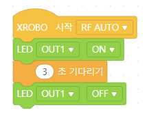
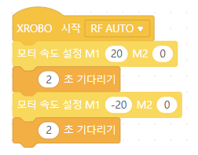
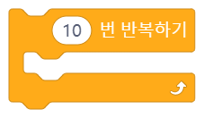
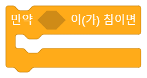
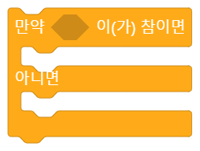
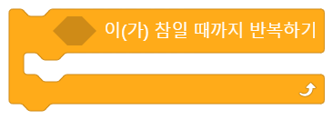

# 제어 블록

## 목차
[01 시간 기다리기](#01-시간-기다리기)  
[02 횟수 반복하기](#02-횟수-반복하기)  
[03 계속 반복하기](#03-계속-반복하기)  
[04 만약](#04-만약)  
[05 만약 아니면](#05-만약-아니면)  
[06 참일 때까지 기다리기](#06-조건-참일-때까지-기다리기)  
[07 참일 때까지 반복하기](#07-조건-참일-때까지-반복하기)  

 
 

## 01 시간 기다리기  
  

### 간단 설명  
`제어 블록` 중 '반복문 블록'입니다. 입력한 시간만큼 코드를 실행하지 않고 기다렸다가 다음 코드를 실행합니다.  

### 빈칸 살펴보기 
(1) 첫번째 빈칸
- 몇 초만큼 기다릴지 입력하는 입력상자입니다.
- `1~N` 사이의 숫자를 입력할 수 있습니다. 숫자를 나타내는 `값 블록`을 넣을 수도 있습니다.
- 예를 들어 여기에 `3`을 입력하면, CPU는 이 블록에서 3초를 기다렸다가 다음 블록을 실행합니다.  

### 언제, 어떻게 사용할까요?
다음 코드를 실행하기 전에 잠깐 기다리고 싶을 때 이 블록을 사용할 수 있습니다.  

(1) 연습 1: LED를 3초 동안 켰다가 꺼봅시다.  
- LED를 3초 동안 켰다가 끄는 것을 어떻게 코딩할 수 있을까요? 먼저 LED를 켜야겠죠? 그 다음엔 3초를 기다려야 할 것입니다. 그리고 마지막으로 LED를 꺼야겠죠. 이렇게 LED를 켜고 끄는 과정을 LED를 켜고 3초를 기다린 다음 LED를 끄는 3가지 단계로 나누었다면, 이 단계대로 코딩을 해봅시다. 그러면 이런 코드가 완성됩니다.  
  

(2) 연습 2: 2초마다 모터가 돌아가는 방향을 바꾸어봅시다.
- 2초마다 모터가 돌아가는 방향을 어떻게 바꿀 수 있을까요? 먼저 모터가 20의 속도로 회전하고 있다고 생각해봅시다. 이렇게 2초를 돌고나면 이제 모터는 반대 방향으로 돌아야합니다. 그러면 이제 모터의 속도를 -20으로 바꿔주어야 하겠죠. 그 다음엔 다시 2초를 기다려야 합니다. 이 과정을 코딩하면 이런 코드가 완성됩니다.  
    
- 만약 모터의 방향을 계속 바꾸고 싶다면 어떻게 해야할까요? `계속 반복하기` 블록에 대해 알아봅시다.  

   
### 더 알아보기

(1) 궁금해요
  - [질문1] 다른 반복문 블록은 입이 있는데, 왜 이 블록은 입이 없는데도 반복문 블록인가요?
  ㄴ 이 블록은 아무것도 실행하지 않는 것처럼 보이지만, 사실 시간이 지나갈 때까지 텅 빈 반복문을 실행하고 있습니다. 따라서 겉으로는 아무것도 하지 않고 기다리는 것처럼 보이지만 사실 반복문을 실행하고 있기에 반복문 블록에 해당합니다. 

 
 

## 02 횟수 반복하기  
 

### 간단 설명  
`제어 블록` 중 '반복문 블록'입니다. 입력한 횟수만큼 안쪽의 코드를 반복합니다.

### 빈칸 살펴보기 
- 첫번째 빈칸: 몇 번만큼 반복할지 입력하는 입력상자입니다. `1~N` 사이의 숫자를 입력할 수 있습니다. 숫자를 나타내는 `값 블록`을 넣을 수도 있습니다. 예를 들어, 여기에 `7`을 입력하면 블록 안쪽의 코드가 7번 반복해서 실행된 후 다음 블록이 실행됩니다.

### 언제, 어떻게 사용할까요?
같은 코드를 여러번 반복해서 실행하고 싶을 때 이 블록을 사용할 수 있습니다.

(1) 예시 1: 내용
  
코드 설명

(2) 예시 2: 변수 사용()

### 연습해보기

(1) 연습 1: 예제
  
코드 설명

### 더 알아보기
- `계속 반복하기` 블록과의 차이점
    - `횟수 반복하기` 블록과 `계속 반복하기` 블록은 안쪽의 코드를 반복하는 것은 같지만, `횟수 반복하기` 블록은 정해진 횟수만큼만 코드를 반복하지만 `계속 반복하기` 블록은 무한으로 반복한다는 점이 다릅니다.  

 
 

## 03 계속 반복하기
 

### 간단 설명  
`제어 블록` 중 '반복문 블록'입니다. 안쪽의 코드를 계속해서 반복합니다.  

### 언제, 어떻게 사용할까요?
코드를 계속 반복하고 싶을 때 

(1) 예시 1: 내용
  
코드 설명

### 연습해보기

(1) 연습 1: 예제
  
코드 설명

### 더 알아보기
- 다른 블럭과 비교  
-   비슷한 블럭과의 차이점  
- 주의 사항
-   사용할 때 자주 하는 실수  
-   코드가 제대로 동작하지 않는 코딩 예시   

 
 

## 04 만약
 
### 간단 설명  
블럭 종류. 어떤 일을 하는지 한 문장으로 설명.  

### 빈칸 살펴보기 
- 종류에 따른 설명  
ㄴ `입력상자`: 값을 '적으세요'  
ㄴ `드롭다운`: 값을 '선택하세요'  
- 값에 대한 설명  
ㄴ 입력 가능한 범위  
ㄴ 자료형  
ㄴ 드롭다운 메뉴 설명

### 언제, 어떻게 사용할까요?
어떤 일을 하는지(하드웨어 제어 블록이라면 구체적인 제어 방법 설명),
어디에 쓸 수 있는지,  
주로 어떤 블록과 함께 쓰이는지 설명

(1) 예시 1: 내용
  
코드 설명

### 연습해보기

(1) 연습 1: 예제
  
코드 설명

### 더 알아보기
- 다른 블럭과 비교  
-   비슷한 블럭과의 차이점  
- 주의 사항
-   사용할 때 자주 하는 실수  
-   코드가 제대로 동작하지 않는 코딩 예시   

 
 

## 05 만약 아니면
 

### 간단 설명  
블럭 종류. 어떤 일을 하는지 한 문장으로 설명.  

### 빈칸 살펴보기 
- 종류에 따른 설명  
ㄴ `입력상자`: 값을 '적으세요'  
ㄴ `드롭다운`: 값을 '선택하세요'  
- 값에 대한 설명  
ㄴ 입력 가능한 범위  
ㄴ 자료형  
ㄴ 드롭다운 메뉴 설명

### 언제, 어떻게 사용할까요?
어떤 일을 하는지(하드웨어 제어 블록이라면 구체적인 제어 방법 설명),
어디에 쓸 수 있는지,  
주로 어떤 블록과 함께 쓰이는지 설명

(1) 예시 1: 내용
  
코드 설명

### 연습해보기

(1) 연습 1: 예제
  
코드 설명

### 더 알아보기
- 다른 블럭과 비교  
-   비슷한 블럭과의 차이점  
- 주의 사항
-   사용할 때 자주 하는 실수  
-   코드가 제대로 동작하지 않는 코딩 예시   
 
 

## 06 조건 참일 때까지 기다리기
 

### 간단 설명  
블럭 종류. 어떤 일을 하는지 한 문장으로 설명.  

### 빈칸 살펴보기 
- 종류에 따른 설명  
ㄴ `입력상자`: 값을 '적으세요'  
ㄴ `드롭다운`: 값을 '선택하세요'  
- 값에 대한 설명  
ㄴ 입력 가능한 범위  
ㄴ 자료형  
ㄴ 드롭다운 메뉴 설명

### 언제, 어떻게 사용할까요?
어떤 일을 하는지(하드웨어 제어 블록이라면 구체적인 제어 방법 설명),
어디에 쓸 수 있는지,  
주로 어떤 블록과 함께 쓰이는지 설명

(1) 예시 1: 내용
  
코드 설명

### 연습해보기

(1) 연습 1: 예제
  
코드 설명

### 더 알아보기
- 다른 블럭과 비교  
-   비슷한 블럭과의 차이점  
- 주의 사항
-   사용할 때 자주 하는 실수  
-   코드가 제대로 동작하지 않는 코딩 예시   
 
 

## 07 조건 참일 때까지 반복하기
 

### 간단 설명  
블럭 종류. 어떤 일을 하는지 한 문장으로 설명.  

### 빈칸 살펴보기 
- 종류에 따른 설명  
ㄴ `입력상자`: 값을 '적으세요'  
ㄴ `드롭다운`: 값을 '선택하세요'  
- 값에 대한 설명  
ㄴ 입력 가능한 범위  
ㄴ 자료형  
ㄴ 드롭다운 메뉴 설명

### 언제, 어떻게 사용할까요?
어떤 일을 하는지(하드웨어 제어 블록이라면 구체적인 제어 방법 설명),
어디에 쓸 수 있는지,  
주로 어떤 블록과 함께 쓰이는지 설명

(1) 예시 1: 내용
  
코드 설명

### 연습해보기

(1) 연습 1: 예제
  
코드 설명

### 더 알아보기
- 다른 블럭과 비교  
-   비슷한 블럭과의 차이점  
- 주의 사항
-   사용할 때 자주 하는 실수  
-   코드가 제대로 동작하지 않는 코딩 예시   
 
 
