# 연산 블록

## 목차
[01 숫자 더하기](#01-숫자-더하기)  
[02 숫자 빼기](#02-숫자-빼기)  
[03 숫자 곱하기](#03-숫자-곱하기)  
[04 숫자 나누기](#04-숫자-나누기)  
[05 숫자 임의의 수 고르기](#05-숫자-임의의-수-고르기)  
[06 숫자 값보다 클 때](#06-숫자-값보다-클-때)  
[07 숫자 값보다 작을 때](#07-숫자-값보다-작을-때)  
[08 숫자 값이 같을 때](#08-숫자-값이-같을-때)  
[09 참/거짓 그리고](#09-참거짓-그리고)  
[10 참/거짓 또는](#10-참거짓-또는)  
[11 참/거짓 부정](#11-참거짓-부정)  
[12 문자열 더하기](#12-문자열-더하기)  
[13 문자열 N번째 문자](#13-문자열-N번째-문자)  
[14 문자열 길이](#14-문자열-길이)  
[15 문자 포함 확인하기](#15-문자-포함-확인하기)  
[16 숫자 나머지](#16-숫자-나머지)  
[17 숫자 반올림](#17-숫자-반올림)  
[18 숫자 다양한 연산](#18-숫자-다양한-연산)  

 
 

> TODO  
> [예제]: 추가하기  
> [입력상자 살펴보기]: 숫자 data type, 값 범위 체크  

## 01 숫자 더하기

### 간단 설명
**두 수를 더한 값**을 계산하는 숫자 `값 블록`입니다.

### 언제, 어떻게 사용하나요?
- 덧셈을 하고 싶을 때 이 블록을 사용할 수 있습니다.  
- 두 입력상자에 더하고 싶은 숫자 두 개를 넣습니다. 두 숫자의 합이 블록의 값이 됩니다.   
- 예를 들어 첫번째 입력상자에 `1`을, 두번째 입력상자에 `5`를 입력하면 이 블록의 값은 `1+5`의 값인 `6`이 됩니다.  
- 주로 `변수 블록`과 함께 사용되어 숫자 변수의 값을 바꾸는 데 쓰입니다.  

### 예제

(1) 변수를 ~으로 설정하기와 같은 코드
  
  

(2) 1부터 N까지 더한 값 구하기  
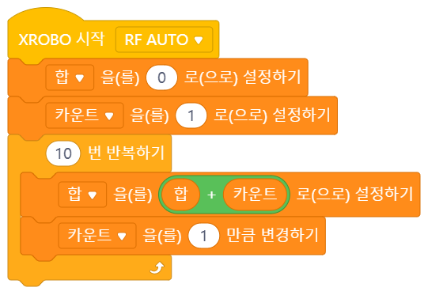  

### 입력상자 살펴보기
- 각각의 입력상자에는 **숫자만** 들어갈 수 있습니다.  
  - 숫자를 직접 입력하거나  
  - 숫자 `값 블록`을 사용하거나  
  - 숫자 `변수 블록`을 사용할 수 있습니다.  
- 입력상자에 들어갈 수 있는 수는 `1~N` 사이의 숫자입니다. 각 숫자가 이 범위를 벗어나거나 두 수의 합이 이 숫자 범위를 넘어가는 경우, 이론적인 계산 값과 블록을 사용하여 계산한 값이 다를 수 있습니다(오버플로우).  

 
 

> TODO  
> [예제]: 추가하기  
> [입력상자 살펴보기]: 숫자 data type, 값 범위 체크  

## 02 숫자 빼기

### 간단 설명
**한 숫자에서 다른 숫자를 뺀 값**을 구하는 숫자 `값 블록`입니다.

### 언제, 어떻게 사용하나요?
- 뺄셈을 하고 싶을 때 이 블록을 사용할 수 있습니다.  
- 두 입력상자에 뺄셈을 하고 싶은 숫자 두 개를 넣습니다. 첫번째 숫자에서 두번째 숫자를 뺀 값이 블록의 값이 됩니다.   
- 예를 들어 첫번째 입력상자에 `8`을, 두번째 입력상자에 `2`를 입력하면 이 블록의 값은 `8-2`의 값인 `6`이 됩니다.  
- 주로 `변수 블록`과 함께 사용되어 숫자 변수의 값을 바꾸는 데 쓰입니다.  

### 예제

(1) 숫자 빼기  
  
  

(2) 변수 블록의 값에 마이너스를 붙이기  
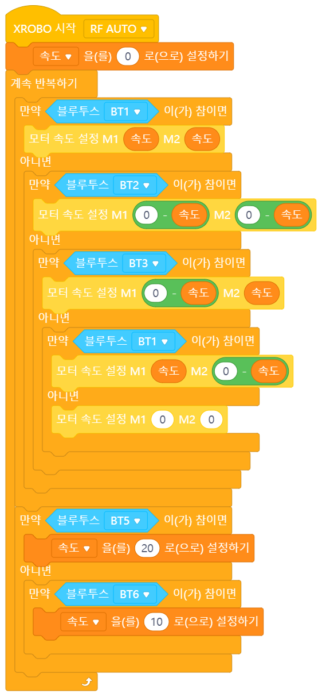  

### 입력상자 살펴보기
- 각각의 입력상자에는 **숫자만** 들어갈 수 있습니다.  
  - 숫자를 직접 입력하거나  
  - 숫자 `값 블록`을 사용하거나  
  - 숫자 `변수 블록`을 사용할 수 있습니다.  
- 입력상자에 들어갈 수 있는 수는 `1~N` 사이의 숫자입니다. 각 숫자가 이 범위를 벗어나는 경우, 이론적인 계산값과 블록을 사용하여 계산한 값이 다를 수 있습니다(오버플로우).  

 
 

> TODO  
> [예제]: 추가하기  
> [입력상자 살펴보기]: 숫자 data type, 값 범위 체크  

## 03 숫자 곱하기

### 간단 설명
**두 수를 곱한 값**을 구하는 숫자 `값 블록`입니다.

### 언제, 어떻게 사용하나요?
- 곱셈을 하고 싶을 때 이 블록을 사용할 수 있습니다.  
- 두 입력상자에 곱하고 싶은 숫자 두 개를 넣습니다. 두 숫자의 곱이 블록의 값이 됩니다.   
- 예를 들어 첫번째 입력상자에 `2`을, 두번째 입력상자에 `5`를 입력하면 이 블록의 값은 `2*5`의 값인 `10`이 됩니다.  
- 주로 `변수 블록`과 함께 사용되어 숫자 변수의 값을 바꾸는 데 쓰입니다.  

### 예제

(1) 변수값 곱하기  
  
  

(2) 1부터 N 사이의 수를 모두 곱한 값(팩토리얼, N!) 구하기  
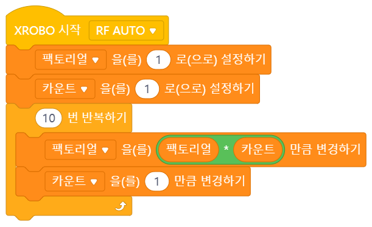  

### 입력상자 살펴보기
- 각각의 입력상자에는 **숫자만** 들어갈 수 있습니다.  
  - 숫자를 직접 입력하거나  
  - 숫자 `값 블록`을 사용하거나  
  - 숫자 `변수 블록`을 사용할 수 있습니다.  
- 입력상자에 들어갈 수 있는 수는 `1~N` 사이의 숫자입니다. 각 숫자가 이 범위를 벗어나거나 두 수의 곱이 이 숫자 범위를 넘어가는 경우, 이론적인 계산 값과 블록을 사용하여 계산한 값이 다를 수 있습니다(오버플로우).  

 
 

> TODO  
> [언제, 어떻게 사용하나요?]: 계산 결과값 data type, 버림인지 type convert 되는지 확인, 나눗셈 몫과 어떤 관련이 있는지 추가 서술  
> [예제]: 추가하기  
> [입력상자 살펴보기]: 숫자 data type, 값 범위 체크  

## 04 숫자 나누기

### 간단 설명
**한 수를 다룬 수로 나눈 값**을 구하는 숫자 `값 블록`입니다.

### 언제, 어떻게 사용하나요?
- 나눗셈을 하고 싶을 때 이 블록을 사용할 수 있습니다.  
- 두 입력상자에 나누고 싶은 숫자 두 개를 넣습니다. 첫번째 숫자에서 두번째 숫자를 나눈 값이 블록의 값이 됩니다.   
- 예를 들어 첫번째 입력상자에 `8`을, 두번째 입력상자에 `2`를 입력하면 이 블록의 값은 `8/2`의 값인 `4`가 됩니다.  
- 나눗셈의 몫과 관련이 깊습니다.
- 주로 `변수 블록`과 함께 사용되어 숫자 변수의 값을 바꾸는 데 쓰입니다.  

### 예제

(1) 숫자 나누기  
  

### 입력상자 살펴보기
- 각각의 입력상자에는 **숫자만** 들어갈 수 있습니다.  
  - 숫자를 직접 입력하거나  
  - 숫자 `값 블록`을 사용하거나  
  - 숫자 `변수 블록`을 사용할 수 있습니다.  
- 두번째 입력상자에는 0을 넣을 수 없습니다. 0으로 나누게 되는 경우, 에러가 발생합니다(ZeroDivisionError).
- 입력상자에 들어갈 수 있는 수는 `1~N` 사이의 숫자입니다. 각 숫자가 이 범위를 벗어나는 경우, 이론적인 계산값과 블록을 사용하여 계산한 값이 다를 수 있습니다(오버플로우).

### 더 알아보기
- 나눗셈의 몫과 나머지
  - 나눗셈의 몫 구하기: `숫자 나누기` 블록과 `숫자 추가연산-반올림`을 사용하여 나눗셈의 몫을 구할 수 있습니다.
  - 나눗셈의 나머지 구하기: `숫자 나머지` 블록을 사용하여 나눗셈의 나머지를 구할 수 있습니다.  

 
 

> TODO  
> [언제, 어떻게 사용하나요?]: 계산 결과값 data type 
> [예제]: 추가하기  
> [입력상자 살펴보기]: 숫자 data type, 값 범위 체크  

## 05 숫자 임의의 수 고르기

### 간단 설명
- 입력한 숫자 범위에서 랜덤하게(임의로) 숫자를 하나 고르는 숫자 `값 블록`입니다.  

### 언제, 어떻게 사용하나요?
- 숫자를 랜덤하게(임의로) 고르고 싶을 때 사용합니다.  
- 입력상자에 숫자를 입력하면 그 범위 안에서 숫자 한 개를 랜덤으로 고릅니다.  
- 예를 들어 첫번째 입력상자에 `1`을, 두번째 입력상자에 `3`을 입력하면 이 블록의 값은 `1~3` 사이의 숫자 중 하나로 랜덤하게 정해집니다. 즉, 이 블록의 값은 `1`이 되거나 `2`가 되거나 `3`이 됩니다.  
- 주로 `변수 블록`과 함께 사용됩니다.  

### 예제
(1) 히포 이빨
  

(2) 확률  
  

### 입력상자 살펴보기
- 각각의 입력상자에는 **숫자만** 들어갈 수 있습니다.  
  - 숫자를 직접 입력하거나  
  - 숫자 `값 블록`을 사용하거나  
  - 숫자 `변수 블록`을 사용할 수 있습니다.  
- 첫번째 입력상자에 들어가는 수가 두번째 입력상자에 들어가는 수보다 반드시 작아야 합니다.  
- 입력상자에 들어갈 수 있는 수는 `1~N` 사이의 숫자입니다. 각 숫자가 이 범위를 벗어나는 경우, 이론적인 계산값과 블록을 사용하여 계산한 값이 다를 수 있습니다(오버플로우).  

 
 

> TODO  
> [언제, 어떻게 사용하나요?]: 계산 결과값 data type 
> [예제]: 추가하기  
> [입력상자 살펴보기]: 숫자 data type, 값 범위 체크  

## 06 숫자 값보다 클 때

### 간단 설명
왼쪽의 숫자와 오른쪽 숫자의 크기를 비교하여 왼쪽이 더 클 때만 `참`이 되는 참/거짓 `값 블록`입니다.  

### 언제, 어떻게 사용하나요?
- 숫자 두 개의 값을 비교하고 싶을 때 사용합니다.  
- 왼쪽의 숫자가 더 큰 경우에만 블록이 `참`이 되고, 왼쪽의 숫자가 오른쪽의 숫자와 같거나 작을 때는 `거짓`이 됩니다.  
- 예를 들어 첫번째 입력상자에 `5`를, 두번째 입력상자에 `3`을 입력하면 `5>3`은 옳은 식이므로 블록의 값이 `참`이 됩니다. 그러나 두번째 입력상자에 `5`가 들어있는 경우 `5>5`는 틀린 식이므로 블록의 값은 `거짓`이 됩니다. 비슷하게 두번째 입력상자에 `9`가 들어있는 경우에도 `5>9`는 틀린 식이므로 블록의 값은 `거짓`이 됩니다.  
- 숫자 값에 따라 다른 코드가 실행되어야 하는 경우에 사용할 수 있습니다.  
- 주로 `제어 블록`과 `변수 블록`과 함께 사용됩니다.  

## 예제

(1) 속도를 증가시킬 수 있는 자동차의 최소 전진 속도 정해주기  
  
  

(2) 확률
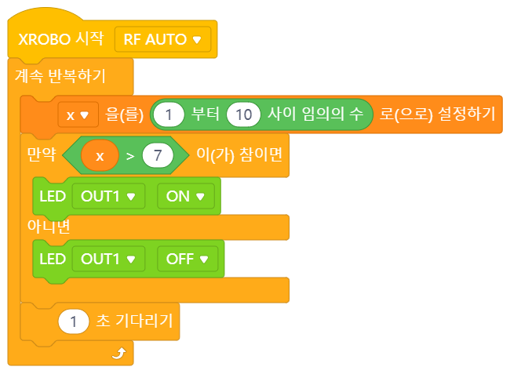  

### 입력상자 살펴보기
- 각각의 입력상자에는 **숫자만** 들어갈 수 있습니다.  
  - 숫자를 직접 입력하거나  
  - 숫자 `값 블록`을 사용하거나  
  - 숫자 `변수 블록`을 사용할 수 있습니다.  
- 입력상자에 들어갈 수 있는 수는 `1~N` 사이의 숫자입니다. 각 숫자가 이 범위를 벗어나는 경우, 이론적인 계산값과 블록을 사용하여 계산한 값이 다를 수 있습니다(오버플로우).  

 
 

> TODO  
> [언제, 어떻게 사용하나요?]: 계산 결과값 data type 
> [예제]: 추가하기  
> [입력상자 살펴보기]: 숫자 data type, 값 범위 체크  

## 07 숫자 값보다 작을 때

### 간단 설명
왼쪽의 숫자와 오른쪽 숫자의 크기를 비교하여 왼쪽이 더 작을 때만 `참`이 되는 참/거짓 `값 블록`입니다.  

### 언제, 어떻게 사용하나요?
- 숫자 두 개의 값을 비교하고 싶을 때 사용합니다.  
- 왼쪽의 숫자가 더 작은 경우에만 블록이 `참`이 되고, 왼쪽의 숫자가 오른쪽의 숫자와 같거나 클 때는 `거짓`이 됩니다.  
- 예를 들어 첫번째 입력상자에 `3`을, 두번째 입력상자에 `5`를 입력하면 `3<5`은 옳은 식이므로 블록의 값이 `참`이 됩니다. 그러나 두번째 입력상자에 `3`이 들어있는 경우 `3<3`은 틀린 식이므로 블록의 값은 `거짓`이 됩니다. 비슷하게 두번째 입력상자에 `1`이 들어있는 경우에도 `3<1`은 틀린 식이므로 블록의 값은 `거짓`이 됩니다.  
- 숫자 값에 따라 다른 코드가 실행되어야 하는 경우에 사용할 수 있습니다.  
- 주로 `제어 블록`과 `변수 블록`과 함께 사용됩니다.  

## 예제

(1) 속도를 증가시킬 수 있는 자동차의 최대 전진 속도 정해주기  
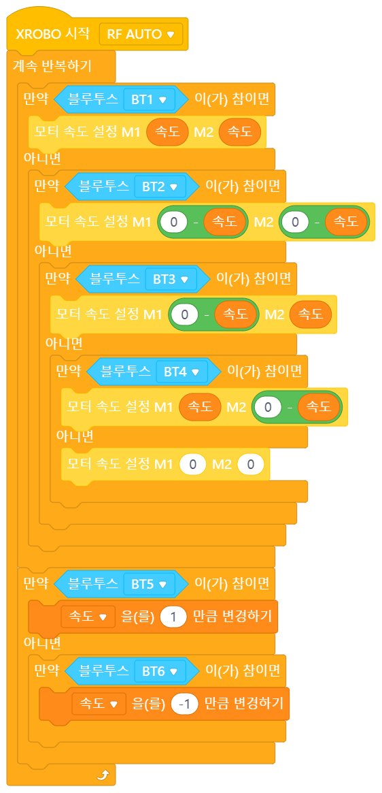  
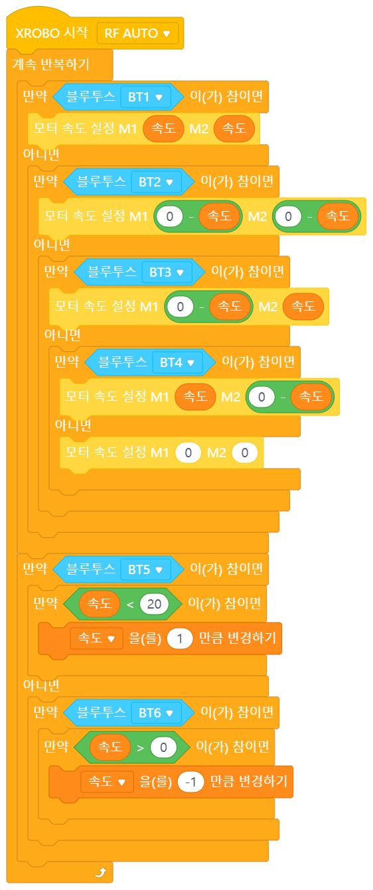  

(2) 확률
  

### 입력상자 살펴보기
- 각각의 입력상자에는 **숫자만** 들어갈 수 있습니다.  
  - 숫자를 직접 입력하거나  
  - 숫자 `값 블록`을 사용하거나  
  - 숫자 `변수 블록`을 사용할 수 있습니다.  
- 입력상자에 들어갈 수 있는 수는 `1~N` 사이의 숫자입니다. 각 숫자가 이 범위를 벗어나는 경우, 이론적인 계산값과 블록을 사용하여 계산한 값이 다를 수 있습니다(오버플로우).  

 
 

> TODO  
> [언제, 어떻게 사용하나요?]: 계산 결과값 data type 
> [예제]: 추가하기  
> [입력상자 살펴보기]: 숫자 data type, 값 범위 체크  

## 08 숫자 값이 같을 때

### 간단 설명
왼쪽의 숫자와 오른쪽 숫자의 크기를 비교하여 두 수의 크기가 같을 때만 `참`이 되는 참/거짓 `값 블록`입니다.  

### 언제, 어떻게 사용하나요?
- 숫자 두 개의 값이 같은지 확인하고 싶을 때 사용합니다.  
- 두 수가 같을 때만 블록이 `참`이 되고, 두 수가 다를 때는 `거짓`이 됩니다.  
- 예를 들어 첫번째 입력상자에 `3`을, 두번째 입력상자에 `3`을 입력하면 `3=3`은 옳은 식이므로 블록의 값이 `참`이 됩니다. 그러나 두번째 입력상자에 `3`이 아닌 `7`이 들어있는 경우 `3=7`은 틀린 식이므로 블록의 값은 `거짓`이 됩니다.  
- 숫자 값에 따라 다른 코드가 실행되어야 하는 경우에 사용할 수 있습니다.  
- 주로 `제어 블록`과 `변수 블록`과 함께 사용됩니다.  

## 예제

(1) 히포 이빨 만들기..  
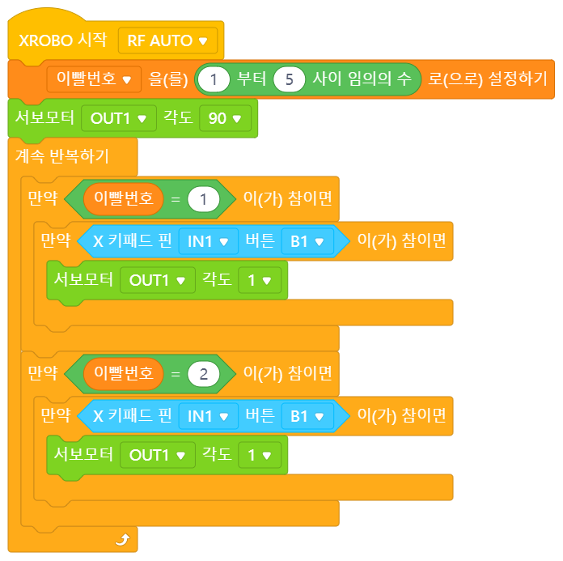  

(2) 속도가 점점 빨라지다가 다시 줄어드는 풍차
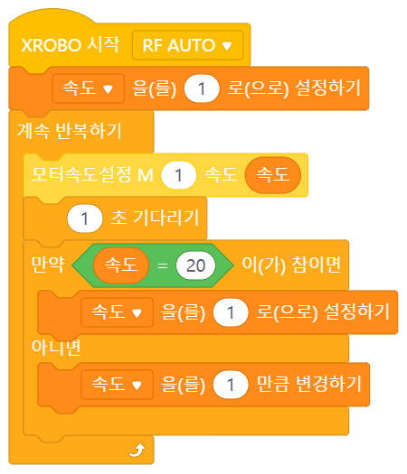  

### 입력상자 살펴보기
- 각각의 입력상자에는 **숫자만** 들어갈 수 있습니다.  
  - 숫자를 직접 입력하거나  
  - 숫자 `값 블록`을 사용하거나  
  - 숫자 `변수 블록`을 사용할 수 있습니다.  
- 입력상자에 들어갈 수 있는 수는 `1~N` 사이의 숫자입니다. 각 숫자가 이 범위를 벗어나는 경우, 이론적인 계산값과 블록을 사용하여 계산한 값이 다를 수 있습니다(오버플로우).  

 
 

> TODO  
> [예제]: 추가하기  
> [더 알아보기]: 논리곱 설명 추가?

## 09 참/거짓 그리고

### 간단 설명
왼쪽의 `값 블록`이 `참`이면서 오른쪽의 `값 블록`도 `참`일 때만 `참`이 되는 참/거짓 `값 블록`입니다.

### 언제, 어떻게 사용하나요?
- 두 개의 `값 블록`의 값이 모두 `참`인지 확인하고 싶을 때 이 블록을 사용할 수 있습니다.  
- 이 블록은 두 입력상자에 들어가는 `값 블록`의 값이 모두 `참`일 때만 `참`이 되고, 둘 중 하나라도 `거짓`이 있는 경우 `거짓`이 됩니다.  
- 따라서 **두 개의 조건을 모두 만족하는 경우를 찾고 싶을 때** 이 블록을 사용할 수 있습니다. `값 블록`은 주로 어떤 조건을 나타낼 때 사용되며 조건을 만족할 때 `참`이 되는데, 이 블록으로 두 조건을 연결하면 두 조건이 모두 만족되는 경우에만 블록의 값이 `참`이 되기 때문입니다.  
- 주로 하드웨어 입력 `값 블록`이나 `제어 블록`과 함께 사용됩니다.  

### 예제

(1) 20초과 30미만 숫자 범위 설정  
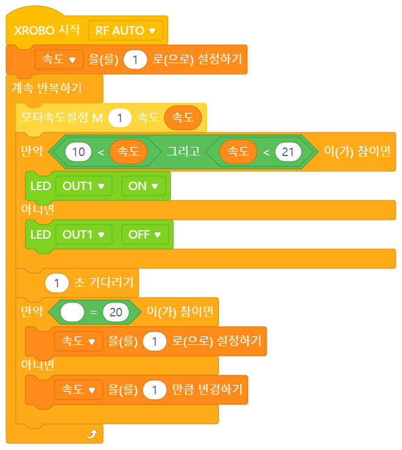  

### 입력상자 살펴보기
- 각각의 입력상자에는 **참/거짓 값만** 들어갈 수 있습니다.  
  - 참/거짓 `값 블록`을 사용하거나
  - 참/거짓 `변수 블록`을 사용할 수 있습니다.  

### 더 알아보기
- `또는` 블록과 비교
  - `또는` 블록은 입력상자에 들어가는 두 개의 참/거짓 `값 블록` 중 하나라도 `참`이 있으면 `참`이 됩니다. 모든 `값 블록`이 `거짓`일 때만 `거짓`이 됩니다.   
  - 반면 `그리고` 블록은 입력상자에 들어가는 두 개의 참/거짓 `값 블록`이 모두 `참`이어야 `참`이 됩니다. `값 블록` 중 하라도 `거짓`이 있으면 `거짓`이 됩니다.  
  - 따라서 조건을 연결할 때 조건 중 적어도 하나만 만족되어도 괜찮다면 `또는` 블록을, 모든 조건이 만족되어야 한다면 `그리고` 블록을 사용해야 합니다.  
- 논리연산자 '그리고(AND)'
  - '더하기' 기호와 '곱하기' 기호를 이용해 숫자와 숫자를 더하거나 곱하여 새로운 값을 구할 수 있는 것처럼, 참/거짓 값과 참/거짓 값도 특정 기호를 이용해 새로운 참/거짓 값을 만들 수 있습니다.  
  - 그 중 하나가 '그리고' 입니다. `참/거짓 그리고` 블록이 '그리고'의 역할을 하는 블록입니다. `참/거짓 그리고` 블록은 두 입력상자에 들어가는 `값 블록`이 모두 `참`일 때만 `참`이 됩니다. 그리고 둘 중 하나라도 `거짓`이면 `거짓`이 됩니다. 참/거짓 값과 참/거짓 값을 이용해 새로운 참/거짓 값을 만들어내는 것입니다.  
  - 이렇듯, 참/거짓 값들을 이용해 새로운 참/거짓 값을 만들어내는 기호를 '논리 연산자'라고 부릅니다. 논리 연산자에는 그리고, 또는, 부정 등이 있습니다.  
  - 특히 '그리고'는 논리곱이라고도 부릅니다.

 
 

> TODO  
> [예제]: 추가하기  
> [더 알아보기]: 논리합 설명 추가?

## 10 참/거짓 또는

### 간단 설명
왼쪽의 `값 블록`이 `참`이거나 오른쪽의 `값 블록`이 `참`일 때 `참`이 되는 참/거짓 `값 블록`입니다.

### 언제, 어떻게 사용하나요?
- 두 개의 `값 블록` 중 하나라도 `참`인지 확인하고 싶을 때 이 블록을 사용할 수 있습니다.  
- 이 블록은 두 입력상자에 들어가는 `값 블록`의 값이 하나라도 `참`인 경우 `참`이 되고, 모든 블록의 값이 `거짓`일 때만 `거짓`이 됩니다.  
- 따라서 **두 개의 조건 중 하나라도 만족하는 경우를 찾고 싶을 때** 이 블록을 사용할 수 있습니다. `값 블록`은 주로 어떤 조건을 나타낼 때 사용되며 조건을 만족할 때 `참`이 되는데, 이 블록으로 두 조건을 연결하면 두 조건이 하나라도 만족되는 경우에는 블록의 값이 `참`이 되기 때문입니다.  
- 주로 하드웨어 입력 `값 블록`이나 `제어 블록`과 함께 사용됩니다.  

### 예제

(1) 20 미만 30 초과 범위 설정
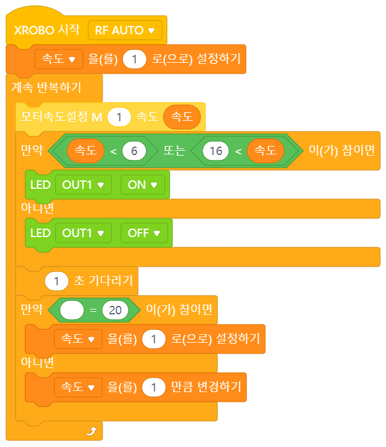  

(2) 같거나 크다 설정
  

### 입력상자 살펴보기
- 각각의 입력상자에는 **참/거짓 값만** 들어갈 수 있습니다.  
  - 참/거짓 `값 블록`을 사용하거나
  - 참/거짓 `변수 블록`을 사용할 수 있습니다.  

### 더 알아보기
- `그리고` 블록과 비교
  - `그리고` 블록은 입력상자에 들어가는 두 개의 참/거짓 `값 블록`이 모두 `참`이어야 `참`이 됩니다. `값 블록` 중 하라도 `거짓`이 있으면 `거짓`이 됩니다. 
  - 반면 `또는` 블록은 입력상자에 들어가는 두 개의 참/거짓 `값 블록` 중 하나라도 `참`이 있으면 `참`이 됩니다. 모든 `값 블록`이 `거짓`일 때만 `거짓`이 됩니다.   
  - 따라서 조건을 연결할 때 조건 중 적어도 하나만 만족되어도 괜찮다면 `또는` 블록을, 모든 조건이 만족되어야 한다면 `그리고` 블록을 사용해야 합니다.  
- 논리연산자 '또는(OR)'
  - '더하기' 기호와 '곱하기' 기호를 이용해 숫자와 숫자를 더하거나 곱하여 새로운 값을 구할 수 있는 것처럼, 참/거짓 값과 참/거짓 값도 특정 기호를 이용해 새로운 참/거짓 값을 만들 수 있습니다.  
  - 그 중 하나가 '또는' 입니다. `참/거짓 또는` 블록이 '또는'의 역할을 하는 블록입니다. `참/거짓 또는` 블록은 두 입력상자에 들어가는 `값 블록`이 하나라도 `참`일 때 `참`이 됩니다. 그리고 모든 블록의 값이 `거짓`일 때에만 `거짓`이 됩니다. 참/거짓 값과 참/거짓 값을 이용해 새로운 참/거짓 값을 만들어내는 것입니다.  
  - 이렇듯, 참/거짓 값들을 이용해 새로운 참/거짓 값을 만들어내는 기호를 '논리 연산자'라고 부릅니다. 논리 연산자에는 그리고, 또는, 부정 등이 있습니다.  
  - 특히 '또는'은 논리합이라고도 부릅니다.

 
 

> TODO  
> [예제]: 추가하기  

## 11 참/거짓 부정

### 간단 설명
입력상자에 들어가는 `값 블록`이 `참`일 때는 `거짓`이 되고, `거짓`일 때는 `참`이 되는 청개구리 참/거짓 `값 블록`입니다.  

### 언제, 어떻게 사용하나요?
- 이 블록은 입력상자에 들어가는 `값 블록`이 `참`일 때는 `거짓`이 되고, `거짓`일 때는 `참`이 됩니다.  
- `값 블록`의 값을 반대로 바꾸고 싶을 때(부정하고 싶을 때) 이 블록을 사용할 수 있습니다.  
- 따라서 **조건을 제외하는 모든 경우를 나타내고 싶을 때** 이 블록을 사용할 수 있습니다. 이 블록은 특히 어떤 조건을 만족하는 경우를 표현하는 것은 너무 복잡하고 어려운데 조건을 만족하지 않는 경우를 표현하는 것은 쉽고 간단한 경우 유용합니다. 조건을 만족하지 않는 경우를 표현한 후 `부정` 블록을 씌워주기만 하면 간결하게 표현할 수 있기 때문입니다.  
- 주로 하드웨어 입력 `값 블록`이나 `제어 블록`과 함께 사용됩니다.  

### 예제

(1) 같거나 크다 = 작다 부정  
  
  

(2) 만약 아니면 코드 순서 바꾸기
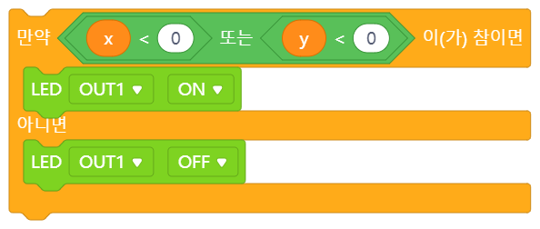  
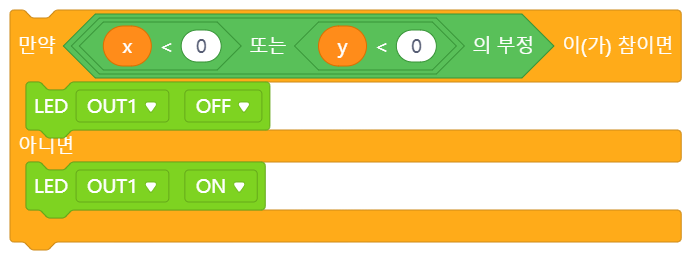  

### 입력상자 살펴보기
- 입력상자에는 **참/거짓 값만** 들어갈 수 있습니다.  
  - 참/거짓 `값 블록`을 사용하거나
  - 참/거짓 `변수 블록`을 사용할 수 있습니다. 

### 더 알아보기
- `만약-아니면` 블록과의 연결고리
  - `만약-아니면` 블록에선 조건을 만족하는 경우 '만약' 쪽의 코드가, 조건을 만족하지 않는 경우 '아니면' 쪽의 코드가 실행됩니다. 즉, '아니면' 코드는 조건을 부정하는 경우에 실행되는 코드인 것입니다.
  - 따라서 원래 조건에 `부정` 블록을 씌우면 '만약' 코드와 '아니면' 코드의 위치를 바꿀 수 있습니다.
- 논리연산자 '부정(NOT)'
  - '더하기' 기호와 '곱하기' 기호를 이용해 숫자와 숫자를 더하거나 곱하여 새로운 값을 구할 수 있는 것처럼, 참/거짓 값과 참/거짓 값도 특정 기호를 이용해 새로운 참/거짓 값을 만들 수 있습니다.  
  - 그 중 하나가 '그리고' 입니다. `참/거짓 그리고` 블록이 '그리고'의 역할을 하는 블록입니다. `참/거짓 그리고` 블록은 두 입력상자에 들어가는 `값 블록`이 모두 `참`일 때만 `참`이 됩니다. 그리고 둘 중 하나라도 `거짓`이면 `거짓`이 됩니다. 참/거짓 값과 참/거짓 값을 이용해 새로운 참/거짓 값을 만들어내는 것입니다.  
  - 또 다른 하나는 '또는' 입니다. `참/거짓 또는` 블록이 '또는'의 역할을 하는 블록입니다. `참/거짓 또는` 블록은 두 입력상자에 들어가는 `값 블록`이 하나라도 `참`일 때 `참`이 됩니다. 그리고 모든 블록의 값이 `거짓`일 때에만 `거짓`이 됩니다. 참/거짓 값과 참/거짓 값을 이용해 새로운 참/거짓 값을 만들어내는 것입니다.  
  - 이렇듯, 참/거짓 값들을 이용해 새로운 참/거짓 값을 만들어내는 기호를 '논리 연산자'라고 부릅니다.
  - '부정'도 논리 연산자 중 하나입니다. 그러나 부정은 '그리고'와 '또는'과 조금 다릅니다. `참 그리고 거짓`이나 `참 또는 참`은 참/거짓 값이 두 개 필요하지만, '부정'은 하나만 있으면 됩니다. `참 부정`이 `거짓`이 되는 것처럼, 계산할 때 참/거짓 값이 하나만 있어도 충분합니다. 이렇게 계산에 필요한 값이 하나만 필요한 경우를 '단항 연산자'라고 부릅니다. 단항에서 '단'은 하나를 뜻합니다. 두 개가 필요하면 숫자 2를 나타내는 '이'를 써서 '이항 연산자'라고 부릅니다.
 
 

> TODO  
> [예제]: 추가하기

## 12 문자열 더하기

### 간단 설명
**문자(열)을 이어 붙여주는** 문자 `값 블록`입니다.

### 언제, 어떻게 사용하나요?
- 문자(열)을 이어붙이고 싶을 때 이 블록을 사용할 수 있습니다.  
- 두 입력상자에 더하고 싶은 문자(열) 두 개를 넣습니다. 첫번째 문자(열) 뒤에 두번째 문자(열)이 이어붙여집니다.   
- 예를 들어 첫번째 입력상자에 `사과`를, 두번째 입력상자에 `바나나`를 입력하면 이 블록의 값은 `사과바나나`이 됩니다.  
- 주로 `변수 블록`과 함께 사용되어 문자 변수의 값을 바꾸는 데 쓰입니다.  
- 입력상자에 수(1, 2, 3 등)를 쓰더라도 숫자를 가리키는 문자로 생각합니다. 예를 들어 입력상자에 `1`과 `3`을 각각 넣으면 숫자 1과 3을 더한 `4`가 되는 것이 아니라 문자 1과 문자 3을 더한 `13`이 됩니다. 

### 입력상자 살펴보기
- 이어붙이고 싶은 문자를 각각 입력합니다.  
- 각각의 입력상자에는 **문자만** 들어갈 수 있습니다.  
  - 문자를 직접 입력하거나
  - 문자 `변수 블록`을 사용할 수 있습니다.

### 더 알아보기
- 문자와 문자열의 차이
  - 일상 생활을 할 때는 문자와 문자열을 같은 말로 쓸 때가 많지만, 코딩을 할 때는 두 단어의 의미가 구분하여 씁니다.  
  - 문자는 'A'나 '가'처럼 문자 하나를 나타냅니다. 반면 문자열은 'ABC'나 '가나다'처럼 문자가 2개 이상 이어져있는 것을 나타냅니다. 이는 컴퓨터가 문자와 문자열을 저장하는 방식이 조금 다르기 때문입니다.  

 
 

> TODO  
> [언제, 어떻게]: index가 0부터 시작되는지 1부터 시작되는지

## 13 문자열 N번재 문자

### 간단 설명
**문자(열)에서 특정 자리의 문자를 가져오는** 문자 `값 블록`입니다.

### 언제, 어떻게 사용하나요?
- 문자(열)에서 특정 자리(N번째)의 문자를 가져오고 싶을 때 사용할 수 있습니다.  
- 예를 들어 첫번째 입력상자에 `사과`를, 두번째 입력상자에 `2`를 입력하면 이 블록의 값은 사과의 두번째 문자인 `과`가 됩니다.  
- 입력상자에 수(1, 2, 3 등)를 쓰더라도 숫자를 가리키는 문자로 생각합니다. 예를 들어 첫번째 입력상자에 `01033334444`를 넣고 두번째 입력상자에 `3`을 넣는다면 `0`이 나옵니다.  

### 예제

(1) 문자열이 포함되어 있으면 LED 켜기
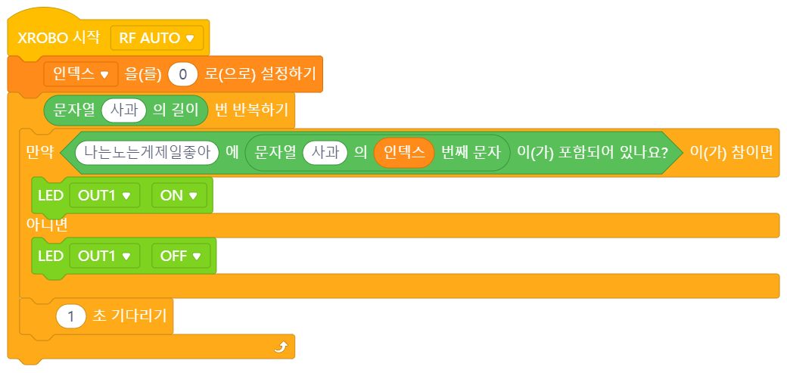  

### 입력상자 살펴보기
(1) 첫번째 입력상자
- 문자를 가져올 문자(열)이 들어가는 자리입니다.  
- 각각의 입력상자에는 **문자만** 들어갈 수 있습니다.  
  - 문자를 직접 입력하거나
  - 문자 `변수 블록`을 사용할 수 있습니다.
(2) 두번째 입력상자
- 몇번째 문자를 가져올지를 정해주는 입력상자입니다.  
- **숫자만** 들어갈 수 있습니다.  
  - 숫자를 직접 입력하거나    
  - 숫자 `값 블록`을 사용하거나
  - 숫자 `변수 블록`을 사용할 수 있습니다.  
- `1~N` 사이의 숫자를 입력할 수 있습니다. (int, float인지 확인 후 범위 추가)    

### 더 알아보기
- 문자와 문자열의 차이
  - 일상 생활을 할 때는 문자와 문자열을 같은 말로 쓸 때가 많지만, 코딩을 할 때는 두 단어의 의미가 구분하여 씁니다.  
  - 문자는 'A'나 '가'처럼 문자 하나를 나타냅니다. 반면 문자열은 'ABC'나 '가나다'처럼 문자가 2개 이상 이어져있는 것을 나타냅니다. 이는 컴퓨터가 문자와 문자열을 저장하는 방식이 조금 다르기 때문입니다.  
- 자리수를 정해줄 때 왜 0부터 시작하나요?
  - 첫번째 문자를 들고오려면 `1`이 아니라 `0`을 넣어야 합니다. 이때 몇번째 문자를 들고 올지 써주는 숫자를 '인덱스(index)'라고 부릅니다. 코딩에서 인덱스는 거의 대부분 `0`부터 시작됩니다.  
  - 이는 문자열이 저장되는 방식과 관련이 있습니다. 컴퓨터는 문자열을 저장할 때 각 문자를 순서대로 이어서 저장합니다. 그리고 문자열의 길이와 첫번째 문자가 저장된 위치(주소)를 기억해놓습니다. 그 후에 3번째 문자가 필요하다고 하면 첫번째 문자가 저장된 위치에서 두 칸 떨어진 위치로 찾아가서 세번째 문자를 찾습니다. 만약 9번째 문자가 필요하다고 하면 첫번째 문자가 저장된 위치에서 여덟 칸 떨어진 위치로 찾아가서 아홉번째 문자를 찾아옵니다. `N`번째 문자를 찾을 때 첫번째 문자가 저장된 위치(주소)에서 `N-1`만큼 떨어진 위치로 찾아가서 문자를 들고오는 것입니다.
  - 첫번째 문자를 들고올 때도 마찬가지입니다. 첫번째 문자는 첫번째 문자가 있는 위치에서 `0`칸 만큼 떨어져있습니다. 따라서 첫번째 문자를 들고오려면 `0`을 입력해주어야 합니다.  
  - 첫번째 문자로부터 얼마나 떨어진 문자를 들고올 건지 적는다고 생각하면 조금 더 편할 것입니다.  

 
 

> TODO
> [언제, 어떻게]: 띄어쓰기도 포함?

## 14 문자열 길이

### 간단 설명
**문자(열)가 몇개의 문자로 이루어져있는지(문자(열)의 길이) 알려주는** 숫자 `값 블록`입니다.

### 언제, 어떻게 사용하나요?
- 문자(열)의 길이란 문자(열)이 몇개의 문자로 이루어져있는지를 뜻합니다. 이 블록은 문자열의 길이를 알려줍니다.  
- 예를 들어 입력상자에 `망고스무디`를 입력하면 `망고스무디`는 다섯 글자이기에 블록의 값이 `5`가 됩니다.  
- 띄어쓰기... 포함?    

### 예제

(1) 문자열이 포함되어 있으면 LED 켜기
  

### 입력상자 살펴보기
(1) 첫번째 입력상자
- 문자를 가져올 문자(열)이 들어가는 자리입니다.  
- 각각의 입력상자에는 **문자만** 들어갈 수 있습니다.  
  - 문자를 직접 입력하거나
  - 문자 `변수 블록`을 사용할 수 있습니다.
(2) 두번째 입력상자
- 몇번째 문자를 가져올지를 정해주는 입력상자입니다.  
- **숫자만** 들어갈 수 있습니다.  
  - 숫자를 직접 입력하거나    
  - 숫자 `값 블록`을 사용하거나
  - 숫자 `변수 블록`을 사용할 수 있습니다.  
- `1~N` 사이의 숫자를 입력할 수 있습니다. (int, float인지 확인 후 범위 추가)    

### 더 알아보기
- 문자와 문자열의 차이
  - 일상 생활을 할 때는 문자와 문자열을 같은 말로 쓸 때가 많지만, 코딩을 할 때는 두 단어의 의미가 구분하여 씁니다.  
  - 문자는 'A'나 '가'처럼 문자 하나를 나타냅니다. 반면 문자열은 'ABC'나 '가나다'처럼 문자가 2개 이상 이어져있는 것을 나타냅니다. 이는 컴퓨터가 문자와 문자열을 저장하는 방식이 조금 다르기 때문입니다.  

 
 

> TODO  
> [언제, 어떻게]: 문자열도 포함되어 있는지 확인할 수 있는가?

## 15 문자 포함 확인하기

### 간단 설명
**문자(열)에 특정 문자가 포함되어 있는지 확인하는** 참/거짓 `값 블록`입니다.

### 언제, 어떻게 사용하나요?
- 문자(열)에 특정 문자가 포함되어 있는지 확인하고 싶을 때 사용할 수 있습니다.   
- 이 블록은 찾고자 하는 문자가 문자(열)가 기준이 되는 문자(열)에 포함되어 있을 때는 `참`이 되고, 포함되어 있지 않을 때는 `거짓`이 됩니다.  
- 예를 들어 첫번째 입력상자에 `사과바나나`를, 두번째 입력상자에 `바나나`를 입력하면 이 블록의 값은 `참`이 됩니다. 그러나 `다람쥐`를 입력하면 `거짓`이 됩니다.  
- 입력상자에 수(1, 2, 3 등)를 쓰더라도 숫자를 가리키는 문자로 생각합니다.

### 예제

(1) 문자열이 포함되어 있으면 LED 켜기
  

### 입력상자 살펴보기
- 첫번째 입력상자에는 문자가 들어있는지 확인하고자 하는 문자(열)을, 두번째 입력상자에는 찾고자 하는 문자를 넣습니다.
- 각각의 입력상자에는 **문자만** 들어갈 수 있습니다.  
  - 문자를 직접 입력하거나
  - 문자 `변수 블록`을 사용할 수 있습니다.

### 더 알아보기
- 문자 포함을 확인하는 다른 방법

 
 

> TODO
> [언제, 어떻게 사용하나요?]: 계산 결과값 data type, 버림인지 type convert 되는지 확인, 나눗셈 몫과 어떤 관련이 있는지 추가 서술  
> [예제]: 추가하기  
> [입력상자 살펴보기]: 숫자 data type, 값 범위 체크  

## 16 숫자 나머지

### 간단 설명
**한 수를 다른 수로 나눈 나머지**를 구하는 숫자 `값 블록`입니다.

### 언제, 어떻게 사용하나요?
- 나눗셈의 나머지를 구하고 싶을 때 이 블록을 사용할 수 있습니다.  
- 두 입력상자에 나누고 싶은 숫자 두 개를 넣습니다. 첫번째 숫자에서 두번째 숫자를 나눈 나머지가 블록의 값이 됩니다.   
- 예를 들어 첫번째 입력상자에 `8`을, 두번째 입력상자에 `3`를 입력하면 이 블록의 값은 `8/3`의 나머지인 `2`가 됩니다.  
- 주로 `제어 블록`과 함께 쓰이며, 어떤 수가 홀수인지 짝수인지, 어떤 수가 다른 수의 배수인지 판단하는 데 쓰입니다(더 알아보기를 참고하세요).  
- `변수 블록`과도 함께 사용되며 숫자 변수의 값을 바꾸는 데 쓰입니다.  

### 예제

(1) 홀짝 구분하기  
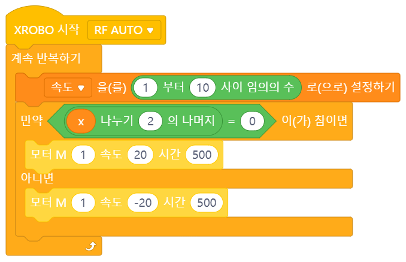  

### 입력상자 살펴보기
- 각각의 입력상자에는 **숫자만** 들어갈 수 있습니다.  
  - 숫자를 직접 입력하거나  
  - 숫자 `값 블록`을 사용하거나  
  - 숫자 `변수 블록`을 사용할 수 있습니다.  
- 두번째 입력상자에는 0을 넣을 수 없습니다. 0으로 나누게 되는 경우, 에러가 발생합니다(ZeroDivisionError).
- 입력상자에 들어갈 수 있는 수는 `1~N` 사이의 숫자입니다. 각 숫자가 이 범위를 벗어나는 경우, 이론적인 계산값과 블록을 사용하여 계산한 값이 다를 수 있습니다(오버플로우).  

### 더 알아보기
- 나눗셈의 몫과 나머지
  - 나눗셈의 몫 구하기: `숫자 나누기` 블록을 사용하여 나눗셈의 몫을 구할 수 있습니다.
  - 나눗셈의 나머지 구하기: `숫자 나머지` 블록을 사용하여 나눗셈의 나머지를 구할 수 있습니다.  
- 나머지를 이용하여 배수 판별하기
  - 홀수와 짝수는 어떻게 구별할 수 있을까요? 일단, 수의 일의 자리 수를 보고 홀수와 짝수를 구별할 수 있습니다. 일의 자리 수가 1, 3, 5, 7, 9이면 홀수, 일의 자리 수가 0, 2, 4, 6, 8이면 짝수이기 때문입니다.
  - 이번엔 짝수의 정의에 따라 홀수와 짝수를 구별해봅시다. 짝수는 2로 나누어떨어지는 수입니다. 홀수는 짝수가 아닌 수입니다. 이때 '2로 나누어 떨어진다'는 말은 '2로 나눈 나머지가 0'이라는 말과 같습니다. 따라서 짝수는 2로 나눈 나머지가 0인 수이고, 홀수는 2로 나눈 나머지가 0이 아닌(1인) 수라고도 말할 수 있습니다.
  - 한 걸음 더 나아가봅시다. '어떤 수가 2로 나누어 떨어진다'는 말과 '어떤 수를 2로 나눈 나머지가 0이다'라는 말은 '어떤 수가 2의 배수'라는 말과 같습니다. 따라서 짝수는 2의 배수이고, 홀수는 2의 배수가 아닌 수입니다.
  - 즉, 3의 배수는 3으로 나누어 떨어지는 수이며, 3으로 나눈 나머지가 0인 수입니다. 4의 배수, 5의 배수도 마찬가지입니다.
  - 코딩을 할 때는 A가 B의 배수인지 아닌지 판별하고 싶을 때 A 나누기 B의 나머지를 구하여 배수 여부를 확인합니다. A 나누기 B의 나머지가 0이라면 A는 B의 배수이고, 나머지가 0이 아니라면 A는 B의 배수가 아니기 때문입니다.  
 
 

> TODO
> [언제, 어떻게]: return data type, 음수 반올림

## 17 숫자 반올림

### 간단 설명
**소수를 반올림한 값**을 구하는 `값 블록`입니다.

### 언제, 어떻게 사용하나요?
- 소수점 첫번째 자리에서 반올림하고 싶은 경우 이 블록을 사용할 수 있습니다.  
- 예를 들어 입력상자에 `1.3`이 들어가는 경우 블록의 값은 `1`이 되고, `1.7`이 들어가는 경우 `2`가 됩니다.  
- 가장 가까운 정수값이 된다고 생각해도 좋습니다. 앞의 예시에서 `1.3`의 경우 `2`보다는 `1`에 가까우므로 `1`이 되고, `1.7`의 경우 `1`보다는 `2`에 가까우므로 `2`가 된다고 생각할 수 있는 것입니다. 음수의 경우에는 이렇게 생각하는 편이 더 계산에 편합니다. `-2.7`의 경우 `-2`보다는 `-3`에 가까우므로 `-3`이 되고, `-2.3`의 경우 `-3`보다는 `-2`에 가까우므로 `-2`가 되는 것입니다.  
- 나눗셈의 몫과 관련이 깊습니다.
- 숫자 값을 반올림하는 작업을 하다보니 주로 `값 블록`과 함께 사용합니다.  

### 입력상자 살펴보기
- 입력상자에는 **숫자만** 들어갈 수 있습니다.  
  - 숫자를 직접 입력하거나  
  - 숫자 `값 블록`을 사용하거나  
  - 숫자 `변수 블록`을 사용할 수 있습니다.  
- 입력상자에 들어갈 수 있는 수는 `1~N` 사이의 숫자입니다. 각 숫자가 이 범위를 벗어나는 경우, 이론적인 계산값과 블록을 사용하여 계산한 값이 다를 수 있습니다(오버플로우).

### 더 알아보기
- 컴퓨터는 소수의 값을 정확히 표현하지 못합니다. 따라서 소수로 계산을 하다보면 오차가 발생할 수 있습니다. 반올림도 마찬가지입니다. 반올림을 했을 때 가끔 `4.0`이 `3.99999...`로 표현되기도 합니다. 그러나 오차가 아주 작기 때문에 아주 세세한 계산을 하는 것이 아닌 이상 계산을 하는 데 있어 큰 문제는 없습니다.  
- 소수점 첫째자리가 아닌 다른 자리수에서 반올림 하기
  - 이 블록은 소수점 첫째자리에서만 반올림을 합니다. 따라서 다른 자리수에서 반올림을 하고 싶을 땐 수에 10이나 100 등 10의 제곱수를 곱하거나 나누어 해당 자리수를 소수점 첫째자리에 오도록 바꿔준 후 반올림을 합니다. 그 다음 같은 방식으로 원래 자리로 바꿔주면 됩니다.
  - 예시1) 소수점 셋째자리에서 반올림을 하고 싶을 땐 일단 원래 수에 100을 곱하여 해당 자리수가 소수점 첫째자리에 오도록 만들어줍니다. 그 후 `숫자 반올림` 블록을 이용하여 반올림을 해줍니다. 그 다음 원래 수에 100을 나누어 다시 원래 수로 만들어줍니다.  
  - 예시2) 천의 자리에서 반올림을 하고 싶을 땐 일단 원래 수에 1000을 나누어 해당 자리수가 소수점 첫째자리에 오도록 만들어줍니다. 그 후 `숫자 반올림` 블록을 이용하여 반올림을 해줍니다. 그 다음 원래 수에 1000을 곱하여 다시 원래 수로 만들어줍니다.  
- 나눗셈의 몫과 나머지
  - 나눗셈의 몫 구하기: `숫자 나누기` 블록과 `숫자 추가연산-반올림`을 사용하여 나눗셈의 몫을 구할 수 있습니다.
  - 나눗셈의 나머지 구하기: `숫자 나머지` 블록을 사용하여 나눗셈의 나머지를 구할 수 있습니다.  

 
 

> TODO

## 18 숫자 다양한 연산

### 간단 설명
**입력한 수의 절댓값, 제곱근, 사인, 코사인 등 다양한 연산 결과를 구할 수 있는** 숫자 `값 블록`입니다.  

### 언제, 어떻게 사용하나요?
- 이 블록을 이용하여 절댓값, 제곱근 등 다양한 값을 구할 수 있습니다.  

### 입력상자 살펴보기
(1) 첫번째 입력상자
- 두번째 입력상자에 입력한 숫자에 어떤 연산을 할지 선택할 수 있는 풀다운입니다.  
  - 절댓값: 입력한 수의 절댓값을 구합니다.
  - 내림값: 입력한 수를 소수점 첫번째 자리에서 버림한 값을 구합니다.
  - 올림값: 입력한 수를 소수점 첫번째 자리에서 올림한 값을 구합니다.
  - 제곱근: 입력한 수의 제곱근을 구합니다.
  - sin: 입력한 수의 사인 값을 구합니다.
  - cos: 입력한 수의 코사인 값을 구합니다.
  - tan: 입력한 수의 탄젠트 값을 구합니다.
  - asin: 입력한 수의 아크사인값을 구합니다.
  - acos: 입력한 수의 아크코사인값을 구합니다.
  - atan: 입력한 수의 아크탄젠트값을 구합니다.
  - ln: 입력한 수에 자연로그를 취한 값을 구합니다.
  - log: 입력한 수에 상용로그를 취한 값을 구합니다.
  - e^: 자연상수를 입력한 수만큼 제곱한 값을 구합니다.
  - 10^: 10을 입력한 수만큼 제곱한 값을 구합니다.

(2) 두번째 입력상자
- 입력상자에는 **숫자만** 들어갈 수 있습니다.  
  - 숫자를 직접 입력하거나  
  - 숫자 `값 블록`을 사용하거나  
  - 숫자 `변수 블록`을 사용할 수 있습니다.  
- 입력상자에 들어갈 수 있는 수는 `1~N` 사이의 숫자입니다. 입력한 숫자나 계산 결과가 이 범위를 벗어나는 경우 결과값이 이론적인 계산값과 다를 수 있습니다(오버플로우).

 
 